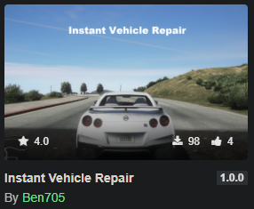

# GTA V Mods

.NET / C# scripts for modding Grand Theft Auto V on PC

## Published mods
Instant vehicle repair: https://www.gta5-mods.com/scripts/instant-vehicle-repair (branch: https://github.com/BenSmith123/GTA-V-mods/tree/vehicle-instant-repair)

## Set up

### IDE
- Visual Studio 2019 (Community edition)

### Requirements:
- Reference these in Visual Studio project `(in references/)`
	- ScriptHookVDotNet.dll (NOTE: Do not use ScriptHookVDotNet2 or ScriptHookVDotNet3 even though they are the latest)
	- NativeUI.dll
- Ensure the GTA V folder also has the two files above in it

### Build/Deploy
- CTRL + SHIFT + B to build .cs file into .dll, this will also automatically deploy to my 'GTAV folder/scripts'
