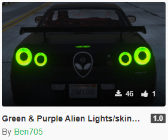

# GTA V Mods

.NET / C# scripts for modding Grand Theft Auto V on PC

Each folder is a different project

## Published mods
Instant vehicle repair: https://www.gta5-mods.com/scripts/instant-vehicle-repair

Default vehicle weapon: https://www.gta5-mods.com/scripts/default-vehicle-weapon

Teleport back to vehicle: https://www.gta5-mods.com/scripts/teleport-back-into-vehicle

Green & purple lights + alien skins: https://www.gta5-mods.com/paintjobs/green-purple-alien-lights-skins-for-skyline-r34

## Set up

### IDE
- Visual Studio 2019 (Community edition)
- Open any of the `.csproj` project files is Visual Studio

### Requirements:
- Reference these in Visual Studio project `(in references/)`
	- ScriptHookVDotNet.dll (NOTE: Do not use ScriptHookVDotNet2 or ScriptHookVDotNet3 even though they are the latest)
	- NativeUI.dll
- Ensure the GTA V folder also has the two files above in it (NativeUI.dll must go in the /scripts folder)

### Build/Deploy
- CTRL + SHIFT + B to build .cs file into .dll, this will also automatically deploy to my 'GTAV folder/scripts'

## TODO
- Script manager - finish
- Random 1-v-1 script
